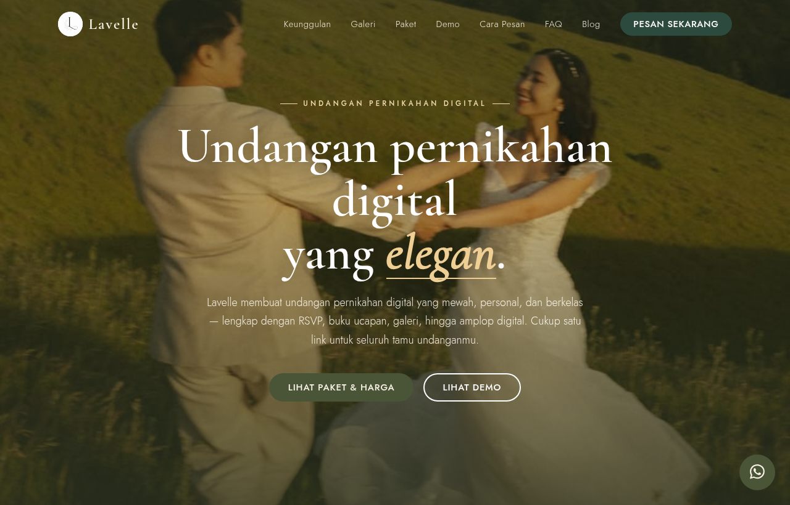
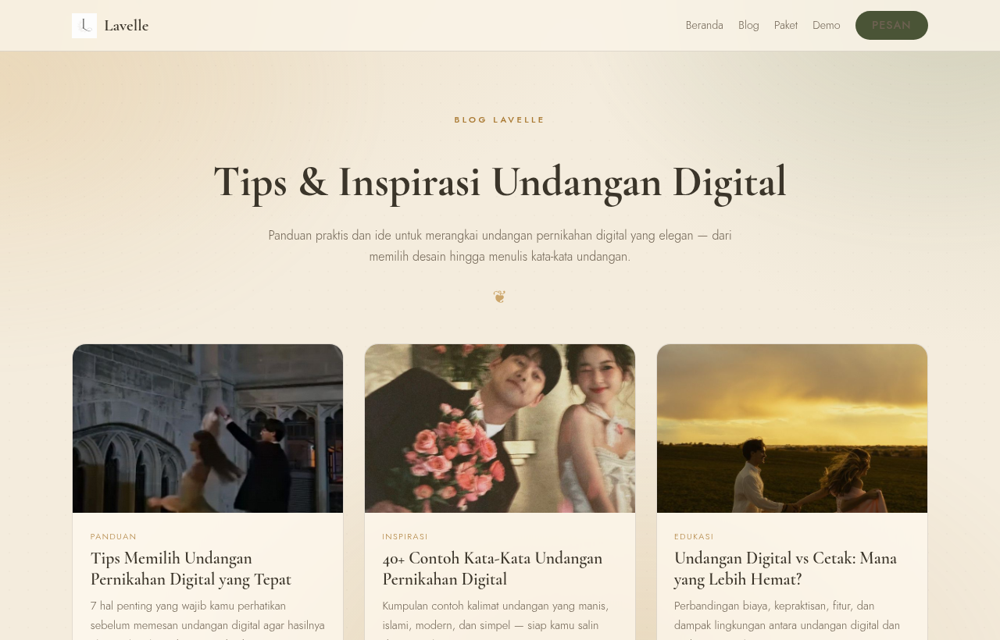
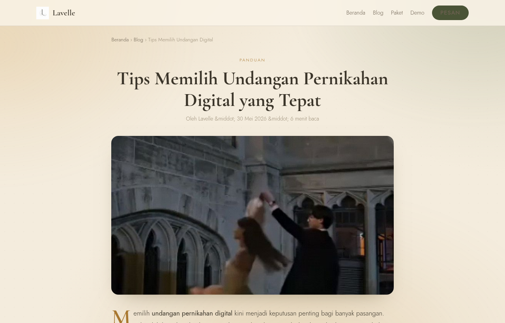

<div align="center">


# Lavelle

**Elegant Digital Wedding Invitations**

Refined, personal, and timeless online invitations — share your special day with
every guest through a single link, beautifully designed and effortless to send.

[**Live Site →**](https://lavelle.my.id) &nbsp;·&nbsp; [**View Demos**](https://lavelle.my.id/demo/) &nbsp;·&nbsp; [**Blog**](https://lavelle.my.id/blog/)


</div>

---

<div align="center">
  
</div>

## Overview

**Lavelle** is a digital wedding invitation studio that turns a couple's love story
into a refined online experience. Every invitation is a single shareable link —
elegant, mobile-first, and complete with everything a modern celebration needs.

The brand name is rooted in French — soft, graceful, and timeless — reflecting our
belief that every wedding deserves to be remembered beautifully.

The site is a **Vue 3 + Vite** single-page app, statically pre-rendered with
**vite-ssg** so every page ships as crawlable HTML (great for SEO), styled with
**Tailwind CSS v4** over a hand-crafted “Golden Garden” design system.

<table>
  <tr>
    <td width="50%"></td>
    <td width="50%"></td>
  </tr>
</table>

## Live Demos

Each demo is fully interactive. Guest names personalize automatically via `?to=`.

| Theme | Style | Highlights |
| --- | --- | --- |
| [**Classic**](https://lavelle.my.id/demo/klasik/) | Blush & Sage | Warm, soft, timeless · data-driven (edit one file per couple) |
| [**Modern**](https://lavelle.my.id/demo/modern/) | Midnight & Gold | Luxe, minimal, full-featured |
| [**Sinema**](https://lavelle.my.id/demo/sinema/) | Velvet & Gold | Cinematic — living backdrop, theater curtains & 3D scroll banners |
| [**Modern 3D**](https://lavelle.my.id/demo/modern-3d/) | Golden Galaxy | Scroll-driven WebGL experience (Three.js) |

→ Browse all at **[lavelle.my.id/demo](https://lavelle.my.id/demo/)**

## Features

- **RSVP** — guests confirm attendance directly from the invitation.
- **Guestbook** — heartfelt wishes and prayers from loved ones.
- **Photo Gallery & Love Story** — pre-wedding photos and a graceful timeline.
- **Live Countdown** — a real-time count down to the big day.
- **Location & Maps** — venue map with one-tap directions.
- **Digital Envelope & Wedding Gift** — gifts via bank transfer / QRIS.
- **Background Music** — a tasteful soundtrack with smooth fade-in.
- **Custom Design** — themes, colors, and layouts tailored to each couple.

## Tech Stack

| Layer | Choice |
| --- | --- |
| Framework | **Vue 3** (`<script setup>`) + **Vue Router** |
| Build | **Vite 6** |
| Static rendering | **vite-ssg** — pre-renders every route to HTML for SEO |
| Styling | **Tailwind CSS v4** + custom design layer |
| Invitation demos | Vanilla JS · Canvas/CSS animations · **Three.js / WebGL** |
| Hosting | **GitHub Pages** via **GitHub Actions** (custom domain) |

## Project Structure

```
lavelle/
├── index.html               # Vite entry (global head)
├── vite.config.js           # Vite + Tailwind + vite-ssg (route pre-render)
├── src/
│   ├── main.js              # App bootstrap (ViteSSG)
│   ├── App.vue              # Root + scroll-reveal
│   ├── router.js            # Routes: /, /blog/, /blog/:slug/
│   ├── pages/              # Home, BlogList, BlogPost
│   ├── components/         # SiteNav, SiteFooter, BlogNav, Preloader, …
│   ├── data/              # site.js, blog.js (generated)
│   └── assets/            # tailwind.css, design.css, blog.css
├── scripts/extract-blog.mjs # One-off: HTML articles → src/data/blog.js
├── public/
│   ├── img/                # Brand assets & photography
│   ├── demo/               # Live invitation demos (static apps)
│   ├── CNAME               # lavelle.my.id
│   ├── sitemap.xml · robots.txt
└── .github/workflows/deploy.yml  # Build & deploy on push
```

## Development

```bash
npm install       # install dependencies
npm run dev       # local dev server (hot reload)
npm run build     # production build → dist/ (pre-rendered)
npm run preview   # preview the production build
```

> The blog is content-driven: articles live in `src/data/blog.js`, rendered by a
> single `BlogPost` component and pre-rendered per URL at build time.

## Deployment

Every push to `main` triggers **GitHub Actions**, which builds the site and
publishes `dist/` to **GitHub Pages** — no manual build step. The custom domain
`lavelle.my.id` is configured via `CNAME`.

## SEO & Performance

- Server-side pre-rendered HTML for every route (home, blog, articles).
- Per-page meta, Open Graph & Twitter cards, canonical URLs.
- Structured data (JSON-LD): Organization, WebSite, Service, FAQPage, BlogPosting.
- `sitemap.xml`, `robots.txt`, and clean, crawlable URLs.

## Service Area

Lavelle operates **100% online** — no physical office. We serve couples across
**Indonesia**, with the entire process handled conveniently over WhatsApp.

## Contact

For inquiries and bookings, please visit **[lavelle.my.id](https://lavelle.my.id)** —
all contact details are available there.

## License

© 2026 Lavelle. All rights reserved. This repository is for portfolio purposes only.
Do not copy, reuse, or redistribute without permission.
